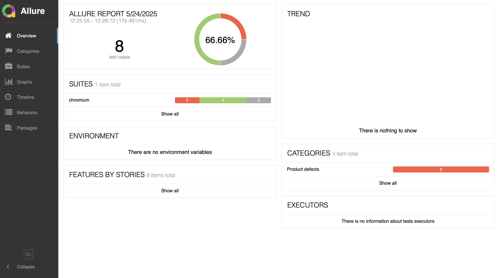

# 🚀 Advanced E2E Testing Framework for Vatan Bilgisayar

[](https://playwright.dev/)
[](https://javascript.info/)
[](https://nodejs.org/)
[](https://github.com/winstonjs/winston)

> A comprehensive, enterprise-grade End-to-End testing framework built with Playwright for testing e-commerce workflows on Vatan Bilgisayar platform.

## 🌟 Features

### ✨ **Core Capabilities**
- 🎭 **Multi-Browser Support**: Chrome, Firefox, Safari, Edge
- 🔄 **Serial & Parallel Execution**: Optimized test execution strategies
- 🧩 **Page Object Model**: Maintainable and scalable test architecture
- 📊 **Advanced Reporting**: HTML, JSON, and custom Winston logging
- 🔐 **Authentication Handling**: Google OAuth integration
- 🛒 **E-commerce Workflows**: Complete shopping journey automation
- 🎨 **Visual Testing**: Screenshot comparison and UI validation
- 🔄 **Auto-retry Mechanisms**: Robust error handling and recovery

### 🚀 **Advanced Features**
- **Single Session Testing**: Browser persistence across test suites
- **State Management**: Maintains user session, cart, and favorites
- **Dynamic Test Data**: Configurable test parameters
- **Cross-platform Compatibility**: Windows, macOS, Linux support
- **CI/CD Integration**: GitHub Actions, Jenkins, Azure DevOps ready

## 🏗️ Architecture

```
├── tests/
│   ├── e2e/
│   │   ├── vatan-bilgisayar.spec.js    # Main test specifications
│   │   └── single-session.spec.js      # Single browser session tests
│   └── fixtures/
├── src/
│   ├── helpers/
│   │   └── helperFunctions.js          # Page Object Model classes
│   ├── logger/
│   │   └── logger_winston.js           # Winston logging configuration
│   ├── config/
│   │   └── test-data.js               # Test data management
│   └── utils/
├── reports/                           # Test execution reports
├── screenshots/                       # Visual evidence storage
├── playwright.config.js              # Playwright configuration
└── package.json
```

## 🚦 Prerequisites

### 📋 **System Requirements**
- **Node.js**: Version 16.x or higher
- **npm**: Version 8.x or higher
- **Operating System**: Windows 10+, macOS 10.15+, Ubuntu 18.04+
- **Memory**: Minimum 4GB RAM (8GB recommended)
- **Disk Space**: 2GB free space for browser binaries

### 🔧 **Dependencies**
```json
{
  "@playwright/test": "^1.40.0",
  "winston": "^3.11.0",
  "dotenv": "^16.3.1",
  "allure-playwright": "^2.9.2"
}
```

## ⚡ Quick Start

### 1. **Clone & Install**
```bash
# Clone the repository
git clone https://github.com/your-username/vatan-e2e-testing.git
cd vatan-e2e-testing

# Install dependencies
npm install

# Install Playwright browsers
npx playwright install
```

### 2. **Run Tests**
```bash
# Run all tests
npx playwright test

#Run a specific test file
npx playwright test e2e-Test1.spec.js
npx playwright test e2e-Test2.spec.js
npx playwright test login.spec.js
```

## 🔧 Configuration

### 🎯 **Playwright Configuration**
```javascript
// playwright.config.js
export default {
  testDir: './tests',
  fullyParallel: false,
  forbidOnly: !!process.env.CI,
  retries: process.env.CI ? 2 : 1,
  workers: process.env.CI ? 1 : undefined,
  reporter: [
    ['html'],
    ['json', { outputFile: 'reports/results.json' }],
    ['allure-playwright']
  ],
  use: {
    baseURL: 'https://www.vatanbilgisayar.com',
    trace: 'on-first-retry',
    screenshot: 'only-on-failure',
    video: 'retain-on-failure'
  },
  projects: [
    {
      name: 'chromium',
      use: { ...devices['Desktop Chrome'] }
    },
    {
      name: 'firefox',
      use: { ...devices['Desktop Firefox'] }
    }
  ]
};
```

### 🗂️ **Test Data Configuration**
```javascript
// src/config/test-data.js
export const TEST_DATA = {
  baseUrl: process.env.BASE_URL || 'https://www.vatanbilgisayar.com/',
  credentials: {
    email: process.env.TEST_EMAIL,
    password: process.env.TEST_PASSWORD
  },
  searchTerms: ['samsung', 'iphone', 'xiaomi'],
  testAddress: {
    city: 'ANKARA',
    district: 'ÇAMLIDERE',
    // ... other address fields
  }
};
```

## 🧪 Test Scenarios

### 🔐 **Authentication Tests**
- ✅ Google OAuth login flow
- ✅ Session persistence validation
- ✅ Login state verification

### 🔍 **Product Search & Browse**
- ✅ Search functionality validation
- ✅ Category filtering
- ✅ Pagination navigation
- ✅ Product listing verification

### ⭐ **Favorites Management**
- ✅ Add products to favorites
- ✅ View favorites list
- ✅ Remove from favorites
- ✅ Favorites persistence

### 🛒 **Shopping Cart Operations**
- ✅ Add to cart from favorites
- ✅ Cart quantity management
- ✅ Cart total calculations
- ✅ Remove items from cart

### 💳 **Checkout Process**
- ✅ Delivery address management
- ✅ Order summary validation
- ✅ Checkout flow completion
- ✅ Order confirmation


## 📝 Logging & Reporting

### 🔍 **Winston Logger Configuration**
```javascript
// src/logger/logger_winston.js
import winston from 'winston';

const logger = winston.createLogger({
  level: 'info',
  format: winston.format.combine(
    winston.format.timestamp(),
    winston.format.colorize(),
    winston.format.simple()
  ),
  transports: [
    new winston.transports.File({ filename: 'logs/error.log', level: 'error' }),
    new winston.transports.File({ filename: 'logs/combined.log' }),
    new winston.transports.Console()
  ]
});
```

### 📈 **Log Levels**
- 🔴 **ERROR**: Test failures and critical issues
- 🟡 **WARN**: Non-critical warnings and fallbacks
- 🔵 **INFO**: Test step information and progress
- 🟢 **DEBUG**: Detailed debugging information

## 🎯 Best Practices


## 🛠️ Troubleshooting

### 🐛 **Common Issues**

#### **Browser Launch Failures**
```bash
# Reinstall browsers
npx playwright install --force

# Check system dependencies
npx playwright install-deps
```

#### **Timeout Issues**
```javascript
// Increase timeout in playwright.config.js
use: {
  actionTimeout: 30000,
  navigationTimeout: 60000
}
```

#### **Flaky Tests**
```javascript
// Add retry mechanism
test.describe.configure({ retries: 2 });

// Use stable selectors
await page.waitForSelector('[data-testid="element"]', { state: 'visible' });
```

## 📊 Allure Reporting
### Prerequisites
- Ensure that you have the Allure command-line tool installed. You can install it using Homebrew (macOS) or download it from the [Allure Releases page](https://github.com/allure-framework/allure2/releases) for other operating systems.
### Generating Allure Reports
1. **Run your Playwright tests**:
  - npx playwright test
  - allure generate allure-results --clean -o allure-report
  - allure open allure-report

  Example Allure Report ( Screenshot )
  -  

### 🔍 **Debugging Tips**
```bash
# Run in debug mode
npm run test -- --debug

# Generate traces
npm run test -- --trace=on

# Capture screenshots
npm run test -- --screenshot=on
```

### 📞 **Support**
- 📧 **Email**: ozgebuyuktorun@outlook.com

## 🤝 Contributing

### 📝 **Guidelines**
1. **Fork** the repository
2. **Create** a feature branch (`git checkout -b feature/amazing-feature`)
3. **Commit** your changes (`git commit -m 'Add amazing feature'`)
4. **Push** to the branch (`git push origin feature/amazing-feature`)
5. **Open** a Pull Request

### 🔍 **Code Review Process**
- ✅ All tests must pass
- ✅ Code coverage above 80%
- ✅ ESLint checks pass
- ✅ Documentation updated
- ✅ Two approving reviews required

### 🏷️ **Version Strategy**
We follow [Semantic Versioning](https://semver.org/):
- **MAJOR**: Breaking changes
- **MINOR**: New features (backwards compatible)
- **PATCH**: Bug fixes

---

## 📄 License

This project is licensed under the MIT License - see the [LICENSE](LICENSE) file for details.

## 🙏 Acknowledgments

- **Playwright Team** for the amazing testing framework
- **Winston Contributors** for robust logging capabilities
- **Community Contributors** for continuous improvements

